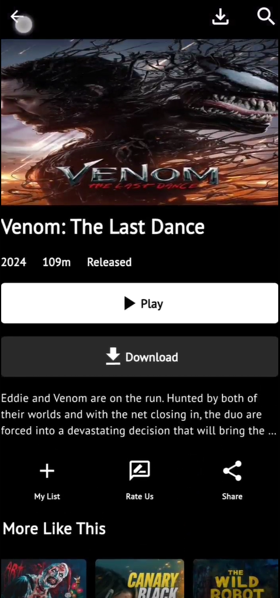
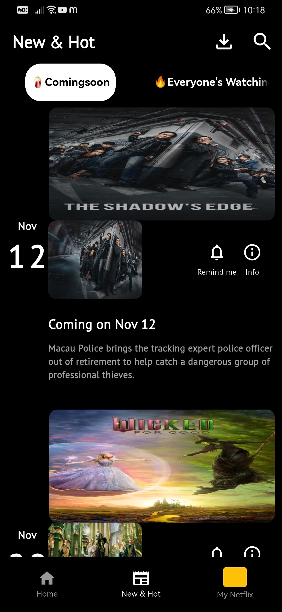
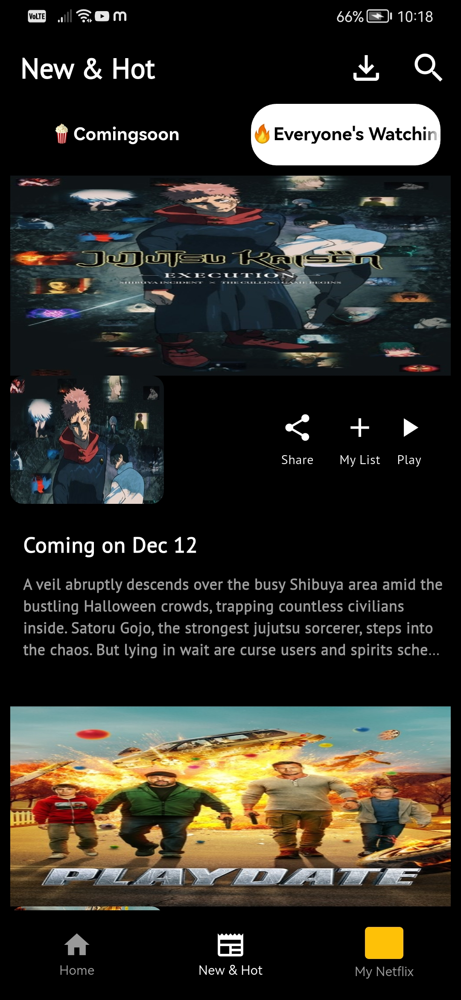
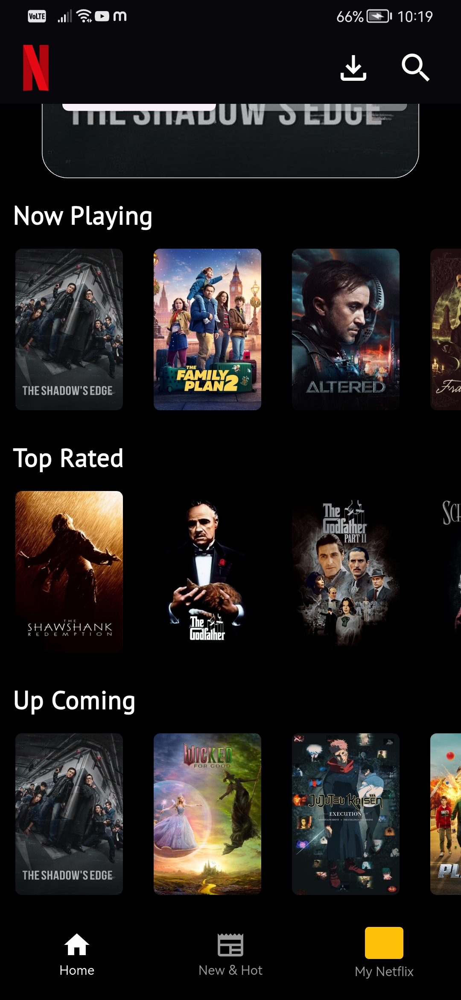
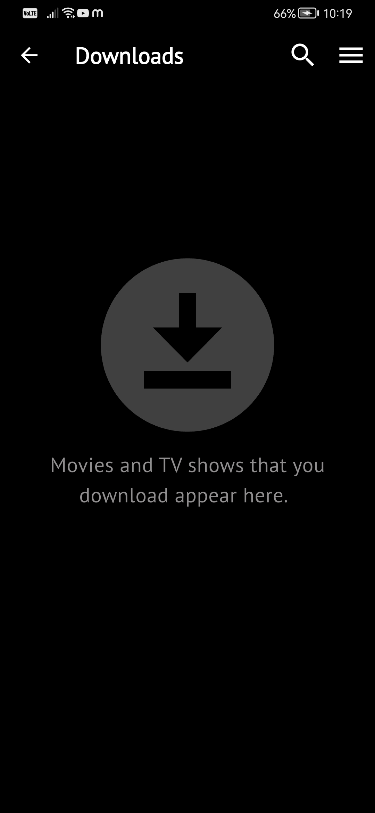
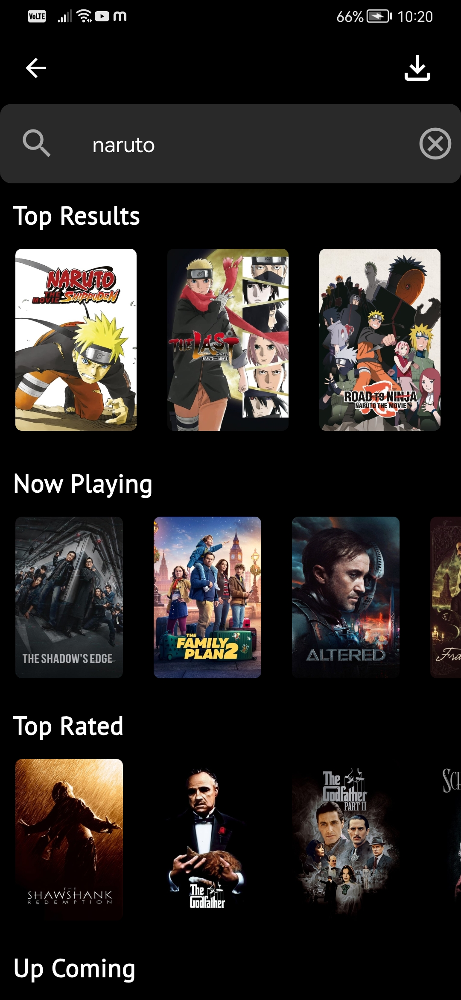
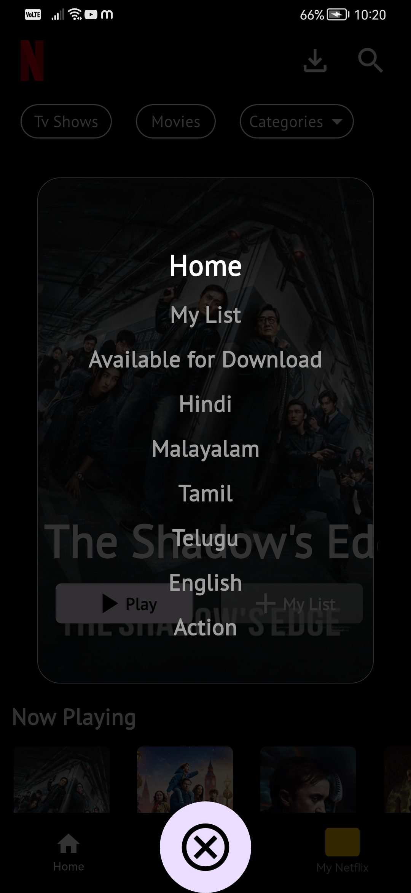

Netflix Clone – Flutter Application

This is a Netflix clone built with Flutter that fetches real movie data using the TMDB API. The app showcases movie listings, trending movies, “New & Hot” releases, and detailed movie pages. Users can explore popular movies and see movie information in a clean, modern interface.

Features

Browse trending and popular movies

View upcoming movies in the “New & Hot” section

Movie details page with title, overview, rating, and release date

Fetch movie data using TMDB API

Clean and responsive UI/UX design

State management using Provider (or GetX if used)

Lottie animations for UI effects

Custom fonts using google_fonts package

